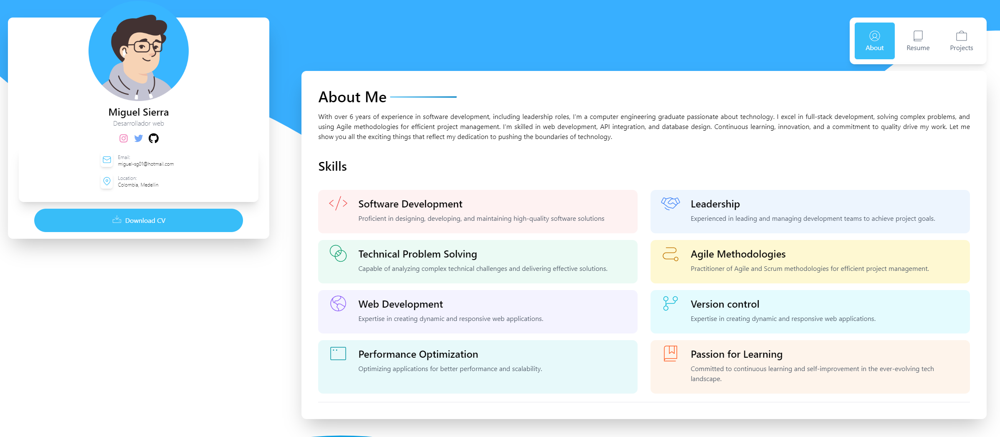

# Portfolio built with Astro.js and Tailwind CSS

Welcome to my portfolio project! This portfolio is built using [Astro.js](https://astro.build/) for static site generation and [Tailwind CSS](https://tailwindcss.com/) for styling. The purpose of this project is to showcase my skills, projects, and experience in a clean and visually appealing way.



## Table of Contents

- [Portfolio built with Astro.js and Tailwind CSS](#portfolio-built-with-astrojs-and-tailwind-css)
  - [Table of Contents](#table-of-contents)
  - [Features](#features)
  - [Demo](#demo)
  - [Prerequisites](#prerequisites)
  - [Installation](#installation)
  - [Usage](#usage)
  - [Contributing](#contributing)

## Features

- Clean and minimalistic design.
- Responsive layout for various screen sizes.
- Showcase of projects, skills, and experience.
- Built-in contact form for easy communication.

## Demo

Check out the live demo of the portfolio [here](https://dylasx.github.io/astro-portfolio/).

## Prerequisites

All you need to get started with this project is a code editor and a basic understanding of HTML, CSS, and JavaScript.

## Installation

1. Clone this repository:

   ```bash
   git clone https://github.com/yourusername/portfolio.git
   cd portfolio

2. Install dependencies

    ```bash
    npm install
    ```

## Usage

1. Run server


    ```bash
     npm run dev
    ```

## Contributing

Contributions to this project are welcome! If you have any improvements, enhancements, or bug fixes, feel free to fork the repository and submit a pull request.

License
This project is licensed under the MIT License.

